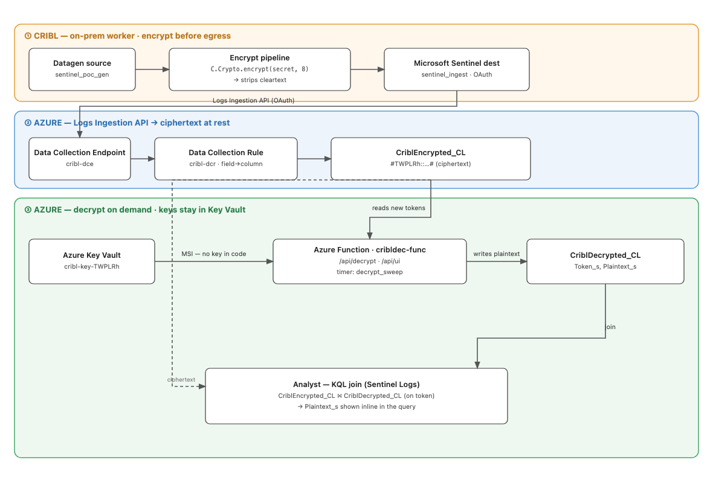
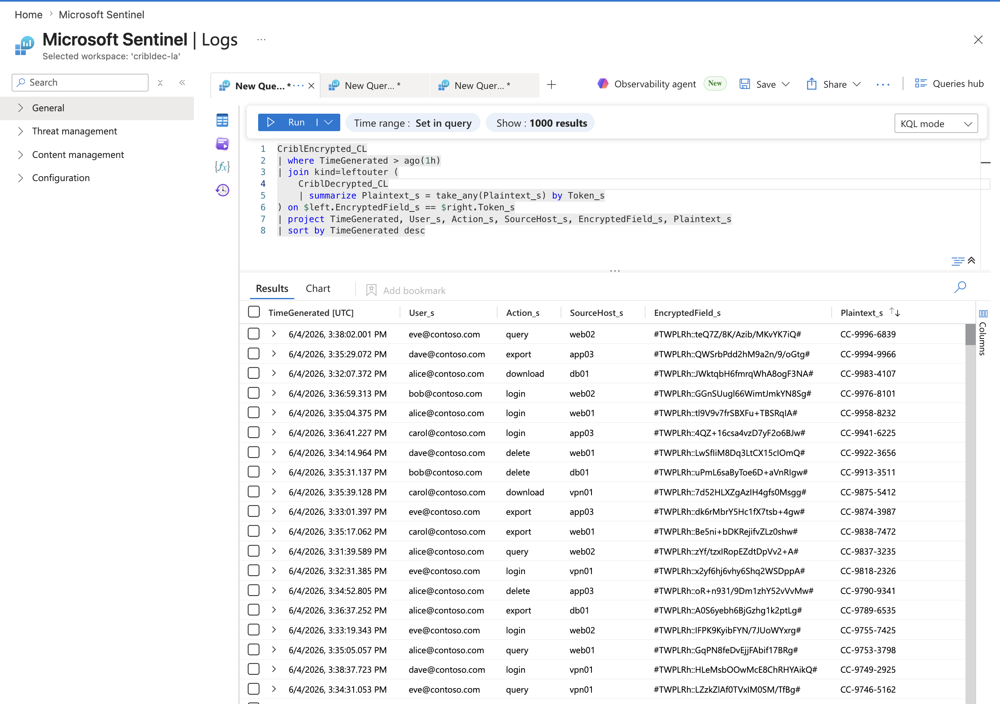
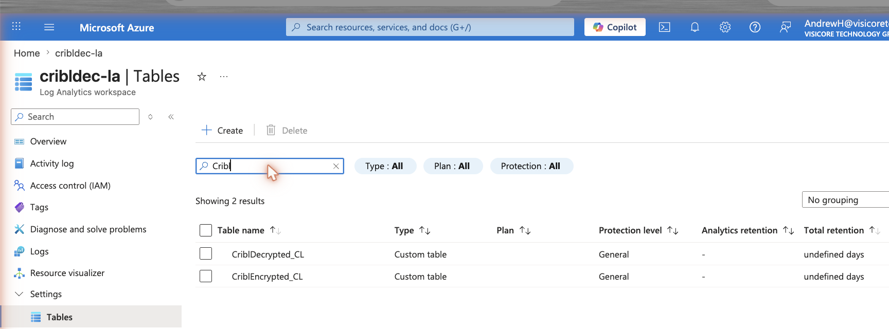
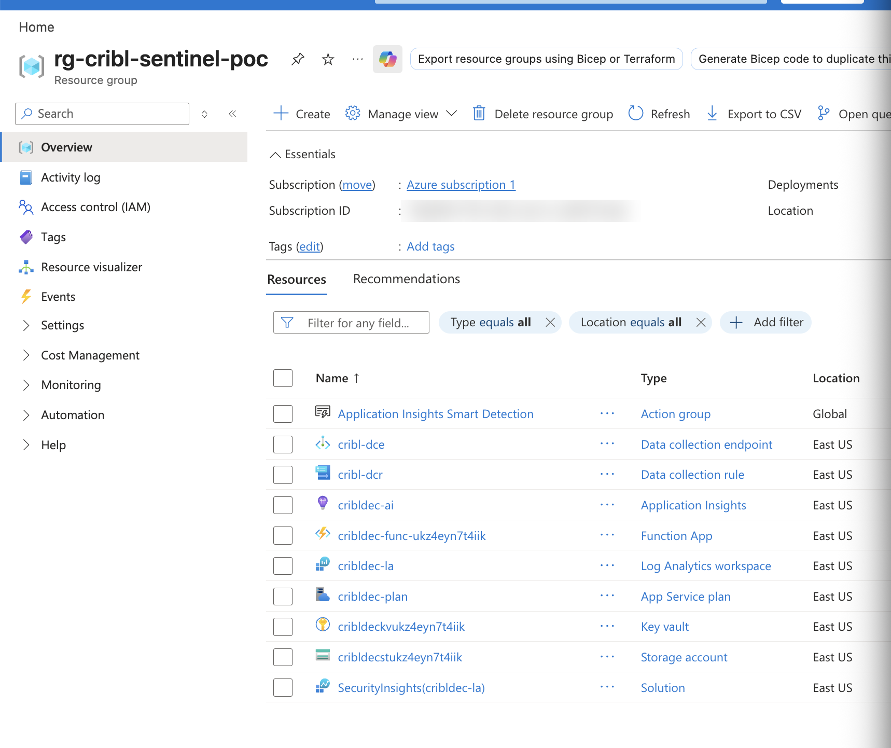
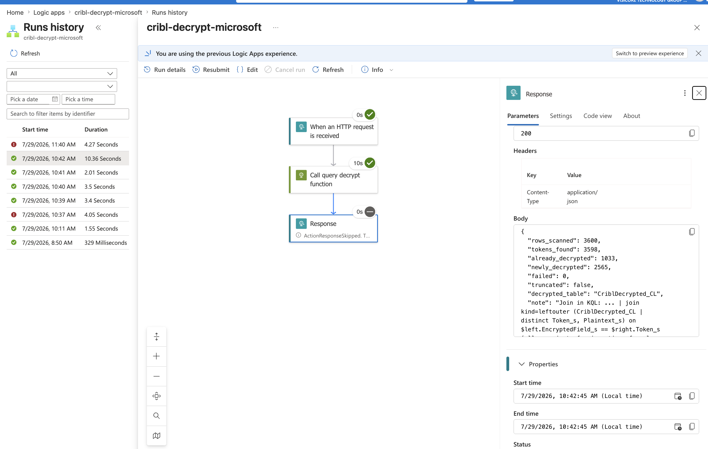
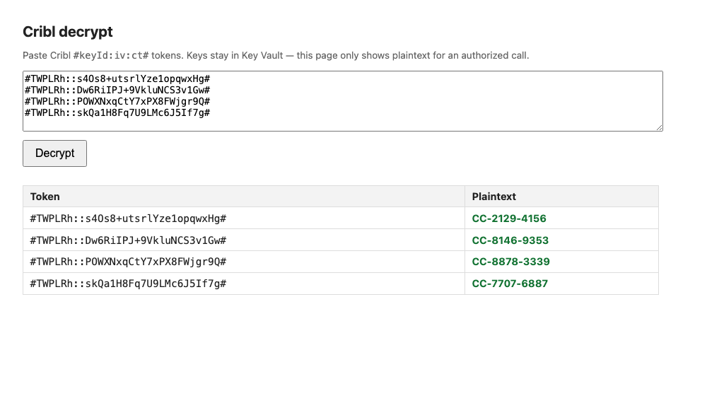

# Cribl `C.Crypto` encrypt → Microsoft Sentinel decrypt

Reproduce Splunk's `| cribldecrypt` experience in Microsoft Sentinel: sensitive
fields are **encrypted by Cribl Stream before they ever leave your network**, land
in a Log Analytics workspace as **ciphertext at rest**, and are **decrypted on
demand** — never continuously, never in the query engine — by an Azure Function
whose keys live only in Azure Key Vault.



> Deep-dive walkthrough with screenshots of every Azure resource:
> [`docs/how-it-works.md`](docs/how-it-works.md)

---

## Why this exists

Splunk users get selective field decryption with Cribl's `| cribldecrypt` custom
search command: analysts see ciphertext in normal searches, and authorized users
decrypt inline. Sentinel has no equivalent, because of one hard constraint that
shaped every design decision here:

**KQL cannot decrypt.** Log Analytics has no AES function, and the plugins that
could call out are unavailable (`python()` and `evaluate http_request` are Azure
Data Explorer-only; `externaldata` reads storage only). There is no Sentinel analog
of a Splunk custom search command. So decryption *must* happen outside the query —
in an Azure Function — with plaintext either returned to an authorized surface
(playbook comment, UI page) or materialized into a second table that KQL can join.

| Question | Answer |
|---|---|
| Can Sentinel run `\| cribldecrypt` inline like a Splunk TA? | **No** — KQL only, no inline Python in Log Analytics. |
| Can we decrypt Cribl-encrypted fields in Azure at all? | **Yes, easily.** `C.Crypto.encrypt()` is AES-256-CBC, 32-byte key, unpadded base64, PKCS7. |
| Do we need Leader filesystem access or to crack `cribl.secret`? | **No.** The raw hex key is revealed **once at key creation** (the `POST system/keys` response includes `plainKey`; also shown once in the UI under Group Settings → Security → Encryption Keys). That hex goes into Key Vault. |

## The token wire format (verified against live Cribl output)

`C.Crypto.encrypt(value, keyclass)` — note the namespace is `C.Crypto`, **not**
`C.Crypt`, and it only exists in worker pipeline contexts (not Leader-side
preview) — emits:

```
#<keyId>:<iv_b64>:<ciphertext_b64>#
```

- The wrapping `#…#` are field markers Cribl uses to locate encrypted substrings
  inside a larger string.
- The middle **IV field is empty** for `useIV=false` keys (decrypt with a 16-byte
  zero IV) and holds base64 of a random 16-byte IV for `useIV=true` keys. The
  token's IV field is authoritative; the key's `useIV` flag is informational.
- There is **no keyclass and no HMAC** in the token. The `keyId` alone selects
  the key.

```
useIV=false  #TWPLRh::2B0RXsyqPFimLaEjyjZx8ga/XOpXn+HIDVnbKOigKwg#
useIV=true   #tqVVX3:lp21TwfoZOew4X+QQ/6Lbw:Q6E40/+W1SqKZv7PiALmNXXrZROzqi/jaTYwCD5/HA8#
```

The crypto core (`src/cribl_decrypt/core.py`) is verified end-to-end against real
`C.Crypto.encrypt()` output captured from a live Cribl worker — both IV modes —
plus Cribl's published knowledge-base example (`tests/test_core.py`).

## Architecture

### Encrypt side (Cribl → Azure)

1. **Cribl worker pipeline** computes the sensitive value, calls
   `C.Crypto.encrypt(value, <keyclass>)`, and **strips the cleartext** so only the
   token leaves the pipeline.
2. **Microsoft Sentinel destination** (the modern one — the "Azure Monitor Logs"
   destination is deprecated) ships events over the **Logs Ingestion API**:
   Entra app (client credentials, `Monitoring Metrics Publisher` on the DCR) →
   **Data Collection Endpoint** → **Data Collection Rule** (maps fields → columns)
   → custom table `CriblEncrypted_CL`. Ciphertext is stored as-is; analysts
   querying the table see only tokens.

### Decrypt side (all surfaces share one Azure Function)

The Function (`src/function_app/decrypt_function.py`, Python v2 model, Flex
Consumption) loads keys from Key Vault secrets named `cribl-key-<keyId>` via its
managed identity. Every Cribl token embeds its own `keyId`, so **batches can mix
keys freely** — each value is parsed, its key fetched (and cached), and decrypted
independently.

| Route | Trigger | Purpose |
|---|---|---|
| `POST /api/decrypt` | HTTP | Core engine: list of tokens in → plaintexts out. Called by the incident playbook, the UI page, and the notebook. |
| `GET /api/ui` | HTTP | Self-contained decrypt page served by the Function itself (same-origin → no CORS, no workbook trusted-host gates). Paste tokens, get plaintext. |
| `POST /api/query-decrypt` | HTTP | **On-demand decrypt driven by a workbook** (see below). Runs analyst KQL, finds tokens in the results, materializes `{Token, Plaintext}` into `CriblDecrypted_CL`. |
| `decrypt_sweep` | Timer (every 5 min) | Legacy continuous materializer. **Disabled by default** (`ENABLE_DECRYPT_SWEEP=true` to re-enable) — it double-ingested every encrypted row. Superseded by `/api/query-decrypt`. |

### On-demand decrypt flow (workbook → Logic App → Function)

Continuous decryption re-ingests every row into the workspace — you pay ingestion
twice and plaintext accumulates for data nobody asked about. The on-demand flow
(designed with Microsoft) decrypts **only what an analyst explicitly requests**:

```
Sentinel workbook "decrypt-request-cribl"
  │  analyst pastes KQL selecting the rows to decrypt, clicks Submit
  │  ARM action → POST {"query": "<kql>"} to the Logic App trigger /run path
  │  (uses the analyst's own Azure RBAC — no keys or callback URLs in the workbook)
  ▼
Logic App "cribl-decrypt-microsoft"  (consumption, pay-per-run)
  │  HTTP action → POST the query to the Function (function key in header)
  ▼
Function /api/query-decrypt
  1. runs the KQL against the workspace (managed identity, Log Analytics Reader)
  2. regex-scans EVERY string cell of the results for embedded #keyId:iv:ct# tokens
     (works no matter which column carries them)
  3. dedups against tokens already in CriblDecrypted_CL (no duplicate rows on resubmit)
  4. decrypts new tokens (keys from Key Vault) and appends {Token, Plaintext}
     rows to CriblDecrypted_CL
  5. returns {rows_scanned, tokens_found, already_decrypted, newly_decrypted, ...}
```

The analyst then joins plaintext inline — the closest KQL gets to `| cribldecrypt`:

```kusto
CriblEncrypted_CL
| join kind=leftouter (CriblDecrypted_CL | distinct Token_s, Plaintext_s)
    on $left.EncryptedField_s == $right.Token_s
| project TimeGenerated, User_s, Action_s, EncryptedField_s, Plaintext_s
```

Only rows covered by a submitted decrypt request have `Plaintext_s`; everything
else stays ciphertext — the selective-decrypt model survives.



### How this addresses double ingestion

Because KQL cannot decrypt inline, showing plaintext in a query requires
materializing it into a second table — some re-ingestion is inherent to the
join-based approach. What the on-demand flow changes is *how much*:

| | Continuous sweep (old, now disabled) | On-demand workbook (current) |
|---|---|---|
| What gets decrypted | **Every** token that lands in `CriblEncrypted_CL`, whether anyone ever queries it or not | Only tokens in the results of a KQL query an analyst explicitly submitted |
| Second-table ingestion | ~100% of the encrypted stream, re-ingested a few minutes after arrival — you pay ingestion twice for everything | Proportional to what analysts actually request; a token is written **at most once ever** (the function checks `CriblDecrypted_CL` first and skips known tokens, so resubmits and overlapping queries write nothing new) |
| Row size | Full plaintext rows | Just `{Token, Plaintext}` pairs — much smaller than the original events |
| Plaintext at rest | Accumulates for the entire stream, silently defeating the selective-decrypt model | Only for data someone with Logic App run rights explicitly asked to reveal — an auditable ARM action |

The sweep still exists in code but exits immediately unless the app setting
`ENABLE_DECRYPT_SWEEP=true` is set — deliberately opt-in, not default.

The two tables involved — ciphertext at rest and the on-demand decrypted join
table — in the Log Analytics workspace:



If a use case needs **zero** second-table ingestion, use the surfaces that
return plaintext without storing it — the incident playbook (comment on the
incident) or the `/api/ui` page — at the cost of losing the inline KQL join.

### Incident playbook (per-incident decryption)

`playbook/playbook.bicep` deploys a Sentinel playbook (Logic App) for the incident
flow: an analytics rule surfaces the encrypted field as a custom detail named
`CriblEncrypted`; the analyst clicks **Run playbook** on the incident; the playbook
posts the tokens to `/api/decrypt` and writes the plaintext back as an **incident
comment** (managed identity + Sentinel Responder role).

## Repo layout

```
src/cribl_decrypt/core.py                       # verified AES-256-CBC/GCM decrypt + token parser
src/function_app/function_app.py                # Functions v2 entry point (re-exports app)
src/function_app/decrypt_function.py            # all four functions (see table above)
src/function_app/host.json                      # Functions host config
tests/test_core.py                              # decrypts real C.Crypto tokens (useIV on/off) + KB example
infra/main.bicep(.bicepparam)                   # Storage + Key Vault + Flex Function App + MSI + RBAC
playbook/playbook.bicep                         # incident playbook: Logic App -> Function -> comment
workbooks/decrypt-request-cribl.workbook.json   # on-demand decrypt workbook (paste KQL -> Submit)
workbooks/cribl-decrypt-workbook.json           # earlier custom-endpoint workbook (browser-gated; kept for reference)
logicapp/cribl-decrypt-microsoft.definition.json# consumption Logic App wiring workbook -> Function
scripts/upload-cribl-key.sh                     # push a cribl-key-<keyId> secret into Key Vault
notebooks/cribl-decrypt.ipynb                   # analyst notebook calling /api/decrypt
azure-pipelines.yml                             # ADO pipeline: infra -> publish function -> playbook
docs/how-it-works.md                            # stage-by-stage walkthrough with portal screenshots
```

## Deployment

Everything below lands in one resource group — all consumption/serverless, so an
idle deployment costs close to nothing:



### 1. Core infra + Function

```bash
az group create -n <rg> -l <region>
az deployment group create -g <rg> -f infra/main.bicep \
  -p namePrefix=cribldec keyAdminObjectId=<your-object-id>
cd src/function_app && func azure functionapp publish <functionAppName> --python
```

(Or use `azure-pipelines.yml` in Azure DevOps — one stage: infra → function →
playbook. Needs an ARM service connection plus `resourceGroup`, `location`,
`keyAdminObjectId` variables.)

### 2. Load Cribl keys into Key Vault

Grab the 64-hex `plainKey` from the Cribl key-creation response (or the one-time
UI reveal), then:

```bash
scripts/upload-cribl-key.sh <keyVaultName> <keyId> <64-hex-key> aes-256-cbc false
```

The Function looks up `cribl-key-<keyId>` and caches it per instance.

### 3. Wire the Cribl → Sentinel ingestion path

Create a DCE, a DCR-based custom table (`CriblEncrypted_CL`), and an Entra app
with `Monitoring Metrics Publisher` on the DCR, then point Cribl's **Microsoft
Sentinel** destination at
`<dce>/dataCollectionRules/<dcrImmutableId>/streams/<streamName>?api-version=2023-01-01`.
Full detail + screenshots in [`docs/how-it-works.md`](docs/how-it-works.md).
Gotcha: in Cribl's destination config, quote `client_id` as a JS string literal.

### 4. On-demand decrypt (workbook + Logic App)

1. Create a consumption Logic App from
   `logicapp/cribl-decrypt-microsoft.definition.json` — replace
   `<functionAppName>` and `<FUNCTION_KEY>`
   (`az functionapp keys list -g <rg> -n <functionAppName>`).
2. In Sentinel → Workbooks, create a workbook and paste
   `workbooks/decrypt-request-cribl.workbook.json` via the Advanced Editor —
   replace `<subscriptionId>`, `<logicAppResourceGroup>`,
   `<workspaceResourceGroup>`, `<workspaceName>`.
3. Grant the Function's managed identity **Log Analytics Reader** on the
   workspace (it runs the analyst's KQL), and set the app settings
   `WORKSPACE_ID` (customer id) and `WORKSPACE_KEY` (shared key, for the
   `CriblDecrypted_CL` writer).
4. Workbook users need permission to fire the Logic App trigger
   (`Logic App Contributor`, or a custom role with
   `Microsoft.Logic/workflows/triggers/run/action`).

### 5. Incident playbook (optional)

```bash
az deployment group create -g <rg> -f playbook/playbook.bicep \
  -p functionAppName=<functionAppName> workspaceName=<workspaceName>
```

Then map the encrypted field to a custom detail named `CriblEncrypted` in your
analytics rule, and attach the playbook via an automation rule or **Run playbook**.

## Testing it

1. Open the **decrypt-request-cribl** workbook, paste
   `CriblEncrypted_CL | where TimeGenerated > ago(1h) | take 50`, hit **Submit**.
2. Watch the Logic App run history: the `Call_query_decrypt_function` action's
   output shows the summary (`tokens_found`, `newly_decrypted`, …). The Response
   step showing *Skipped* is normal — ARM-triggered runs are fire-and-forget.

   
3. After ~1–2 min of ingestion lag, run the join query above: rows covered by
   your submitted query show plaintext; everything else stays ciphertext.
4. Resubmit the same query — `already_decrypted` rises and `newly_decrypted`
   drops to zero: the dedup guard preventing duplicate rows.

Or skip the whole chain and use the Function's own page: `/api/ui?code=<functionKey>`.



Local crypto check (no Azure needed):

```bash
python3 -m venv .venv && ./.venv/bin/pip install cryptography
./.venv/bin/python tests/test_core.py   # -> OK (KB example + live useIV false/true + parser)
```

## Security notes (POC → prod)

- **Key material** exists in exactly two places: Cribl's keystore and Key Vault.
  The Function reads it via managed identity (`Key Vault Secrets User`); nothing
  is in code, config, or the repo.
- The Logic App carries a **function key** in its definition. For production,
  switch the Function to Easy Auth and call it with the Logic App's managed
  identity instead.
- `CriblDecrypted_CL` accumulates plaintext for everything ever requested.
  Consider a short retention policy on that table, and table-level RBAC so only
  the authorized group can read it.
- The workbook path is governed by Azure RBAC end to end: submitting a decrypt
  request requires rights to run the Logic App trigger — an auditable ARM action.
- `WORKSPACE_KEY` (legacy shared-key writer) is the weakest credential in the
  chain; replace the writer with a DCR/Logs-Ingestion path + managed identity
  for production.

## License

MIT — see [LICENSE](LICENSE).
