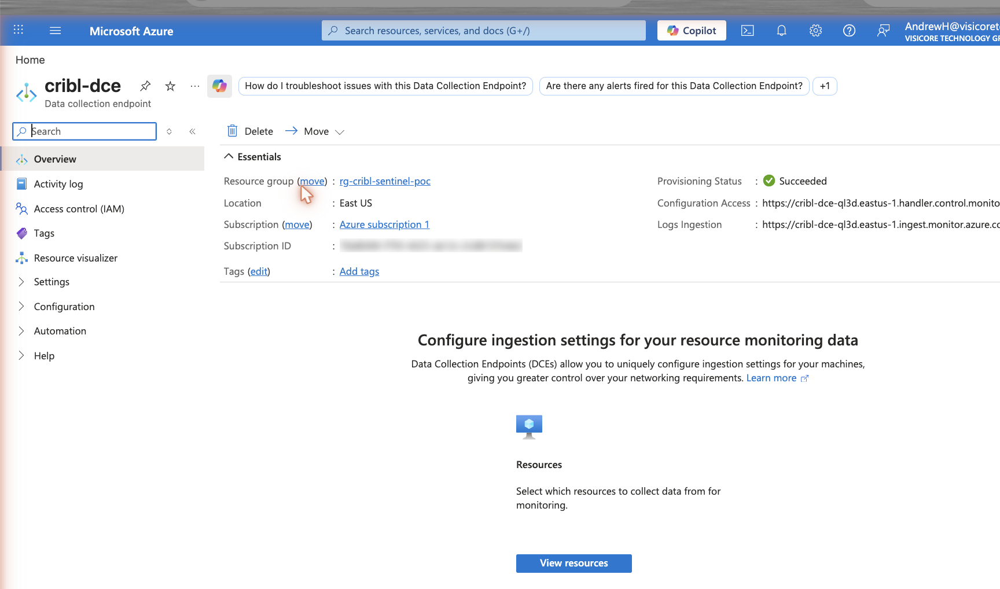
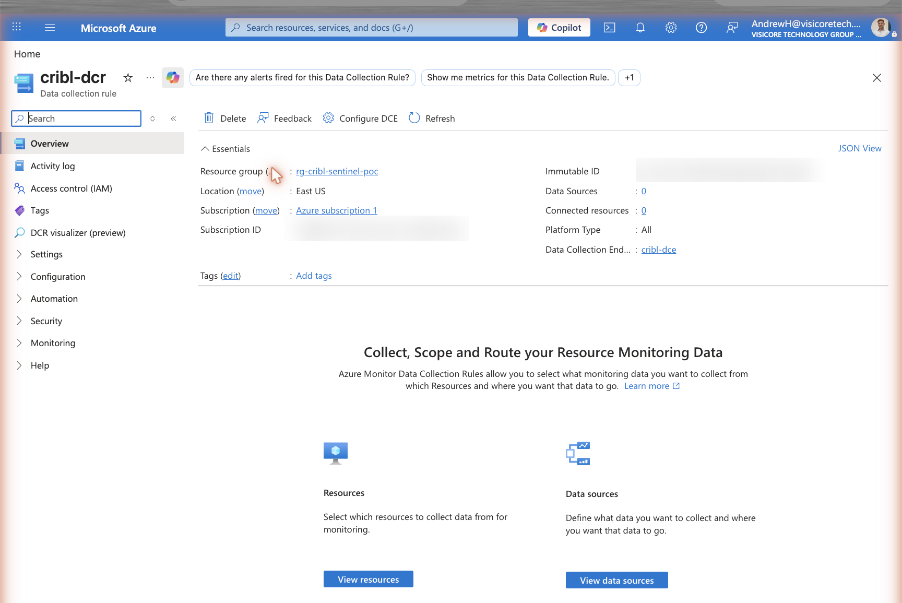
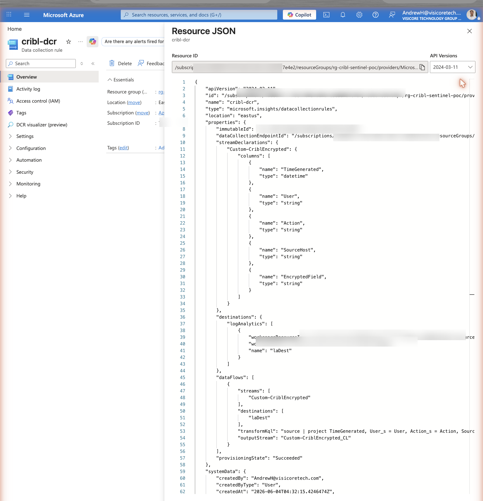
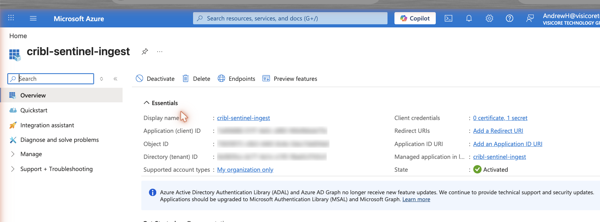
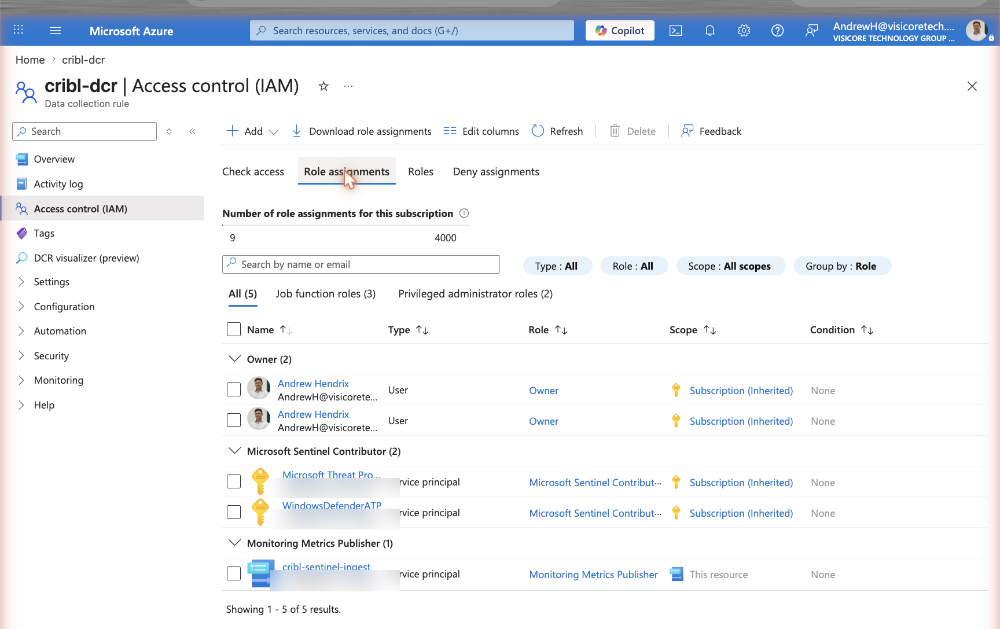
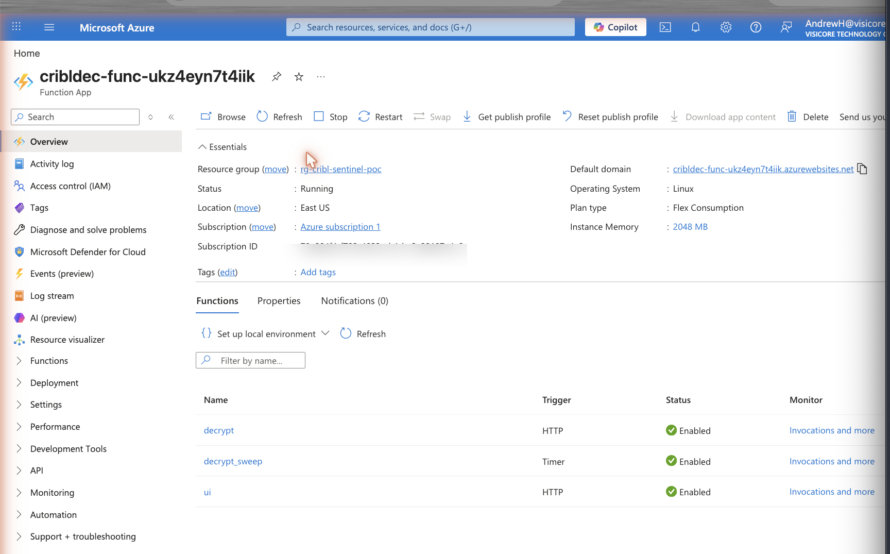
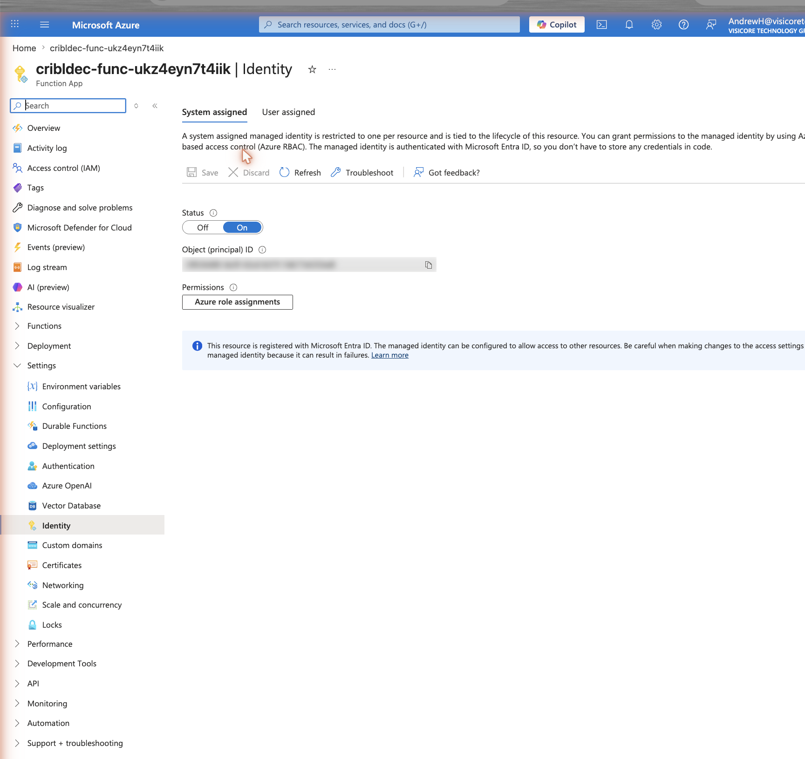
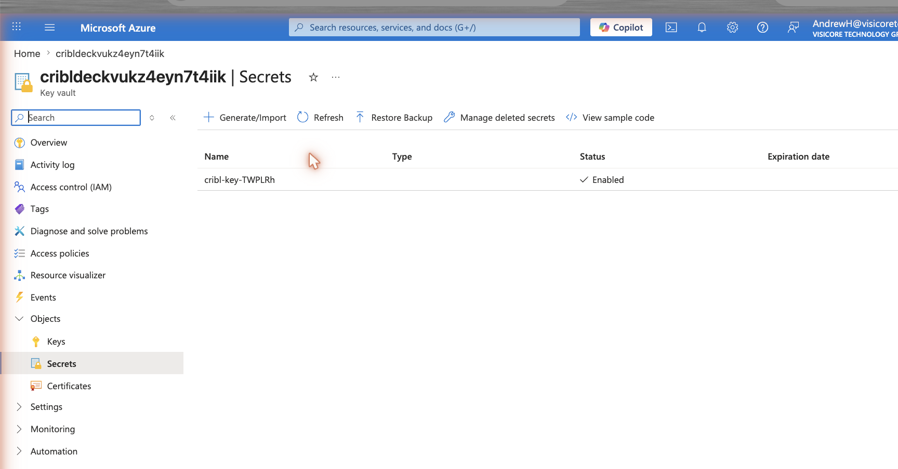
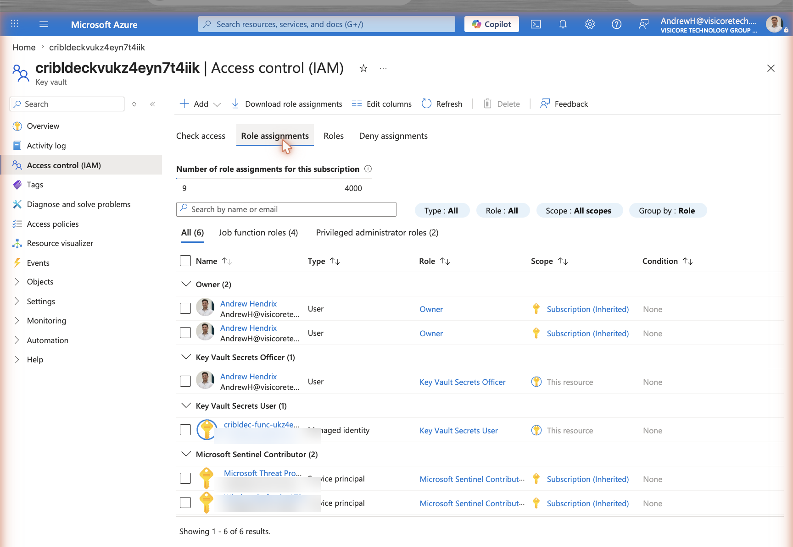

# How it works — Cribl → Sentinel encrypt/decrypt

End-to-end architecture of the POC: sensitive fields are **encrypted in Cribl before
egress**, land in Microsoft Sentinel as **ciphertext at rest**, and are **decrypted
on demand** by an Azure Function whose keys live only in Key Vault.

## The problem it solves

Keep sensitive fields (SSNs, card numbers, tokens) encrypted at rest in Sentinel — so
an analyst running a normal search sees only ciphertext — but still decryptable on
demand by authorized people. This mirrors Splunk's `| cribldecrypt`.

**The hard constraint that shaped every decision:** KQL cannot decrypt. Log Analytics
has no AES function and blocks the plugins that could call out (`python()`,
`evaluate http_request` are ADX-only; `externaldata` is storage-only). So decryption
*must* happen outside the query — hence a Function plus a materialized table, not a
clever KQL snippet.

## Data flow


Encryption happens at the Cribl worker (zone ①); ciphertext lands in `CriblEncrypted_CL`
via the Logs Ingestion API (zone ②); decryption is on demand by the Function, which pulls
the key from Key Vault and materializes plaintext into `CriblDecrypted_CL` for the inline
KQL join (zone ③).

## In action

**Decrypt inline in a Sentinel search** — the KQL join surfaces `Plaintext_s` next to the
at-rest ciphertext (`EncryptedField_s`). Analysts running an ordinary query see only the
ciphertext; the join resolves plaintext the Function already produced.


**The on-demand decrypt page** (`/api/ui`) — served by the Function itself, same-origin
(no CORS, no browser gates). Paste tokens, get plaintext; keys never leave Key Vault.


**The deployed Azure resources** — `rg-cribl-sentinel-poc`. Everything is consumption /
near-free; the DCE + DCR carry the Logs Ingestion path.


## Stage by stage

### 1. Encrypt in Cribl (before it ever leaves your network)

On the `defaultHybrid` worker, the pipeline `sentinel_poc_encrypt` takes each event,
computes a sensitive value, and calls `C.Crypto.encrypt(value, 8)`. Keyclass `8`
selects key **TWPLRh** (AES-256-CBC). The result is a token `#TWPLRh::<base64>#`. The
pipeline then **strips the cleartext** so only the token (plus non-sensitive fields)
continues. The AES key lives in Cribl's keystore, sealed by `cribl.secret` — never in
the event.

> Note: the Cribl expression namespace is `C.Crypto` (not `C.Crypt`), and it is only
> available in worker pipeline contexts — not in Leader-side preview.

### 2. Ship to Sentinel via the modern path

The `sentinel_ingest` destination (Cribl's **Microsoft Sentinel** destination — the
non-deprecated one; the legacy "Azure Monitor Logs" Data Collector API retires
2026-09-14) authenticates to Azure as the Entra app `cribl-sentinel-ingest` (OAuth,
scope `https://monitor.azure.com/.default`) and POSTs to the **Data Collection
Endpoint** (`cribl-dce`). The **Data Collection Rule** (`cribl-dcr`) maps the incoming
fields to columns and routes them into `CriblEncrypted_CL`. The data is now at rest as
**ciphertext** — any normal query of that table shows only `#TWPLRh::…#`.

The deployed ingestion path, piece by piece. The **DCE** (`cribl-dce`) exposes the Logs
Ingestion URL:



The **DCR** (`cribl-dcr`) is bound to that endpoint and the workspace…



…and its JSON makes the field-to-column mapping and `outputStream: Custom-CriblEncrypted_CL`
explicit:



The Entra app `cribl-sentinel-ingest` authenticates the worker and is granted *Monitoring
Metrics Publisher* scoped to the DCR only:





The ciphertext lands in `CriblEncrypted_CL` — one of the two custom tables in the workspace
(the second, `CriblDecrypted_CL`, holds the materialized plaintext from stage 4):


### 3. Decrypt on demand (outside KQL)

The Azure Function `cribldec-func` (Flex Consumption, Python v2) is the decrypt engine.
Given a token it:

1. parses the `keyId` out of the token (`TWPLRh`),
2. pulls `cribl-key-TWPLRh` from **Key Vault** via its **managed identity** (no key
   material in code, logs, or queries),
3. runs AES-256-CBC + PKCS7 with the IV from the token (zero IV when the key is
   `useIV=false`),
4. returns the plaintext.

The Function runs on **Flex Consumption** (scales to zero) and hosts the three surfaces —
`decrypt` (HTTP), `ui` (HTTP), and `decrypt_sweep` (timer):



It authenticates with a **system-assigned managed identity** (no credentials in code)…



…which is granted *Key Vault Secrets User* on the vault, where each key's hex lives as
`cribl-key-<keyId>`:





The same crypto is exposed three ways:

| Surface | What it is | Gates |
|---|---|---|
| `/api/decrypt` | HTTP API everything else calls | function key |
| `/api/ui` | paste-and-decrypt web page served **by the Function** (same-origin) | function key, none else |
| `decrypt_sweep` | **timer**, every 5 min: reads new tokens → decrypts → writes `CriblDecrypted_CL` | — |

### 4. See it decrypted inline in a search

Because the timer materializes plaintext into `CriblDecrypted_CL`, an analyst gets
decrypted values **in a normal KQL query** by joining:

```kql
CriblEncrypted_CL
| join kind=leftouter (
    CriblDecrypted_CL
    | summarize Plaintext_s = take_any(Plaintext_s) by Token_s
  ) on $left.EncryptedField_s == $right.Token_s
| project TimeGenerated, User_s, Action_s, SourceHost_s, EncryptedField_s, Plaintext_s
| sort by TimeGenerated desc
```

KQL still isn't decrypting — it's looking up the plaintext the Function already
produced. The sweep decrypts tokens once they are 6–11 min old (a non-overlapping time
band that avoids re-processing during ingestion lag), so the newest rows show a blank
`Plaintext_s` until the next sweep; add `| where isnotempty(Plaintext_s)` to hide them.

## How decryption actually happens (in detail)

### Two key stores — don't confuse them

- **Cribl's local KMS** holds the key used to **encrypt**, sealed by `cribl.secret`, on
  the worker.
- **Azure Key Vault** holds a *copy* of the same 32-byte key (as `cribl-key-TWPLRh`),
  used by the Function to **decrypt**.

You copy the hex across once at key creation. The decrypt side only ever touches Key
Vault; `cribl.secret` never leaves Cribl.

### Token → plaintext (the code path)

When the Function receives a token like `#TWPLRh::2B0RX…KoigKwg#`
(`decrypt_function.py` + `core.py`):

**1. Parse the token** — `parse_token()` splits `#<keyId>:<iv>:<ciphertext>#`:

```
keyId          = "TWPLRh"
iv_b64         = ""            (empty → useIV=false → zero IV)
ciphertext_b64 = "2B0RXsyqPFimLaEjyjZx8ga/XOpXn+HIDVnbKOigKwg"
```

The **keyId comes from the token itself** — that is how the Function knows which key to
fetch.

**2. Fetch the key from Key Vault** — `_load_key("TWPLRh")`:

```python
SecretClient(vault_url=_KV_URI, credential=DefaultAzureCredential()) \
    .get_secret("cribl-key-TWPLRh")
```

- `DefaultAzureCredential` is the Function's **managed identity** — there is **no
  password or connection string** anywhere. The MSI presents an Entra token; Key Vault
  honors it because that identity was granted **Key Vault Secrets User**.
- The secret value is a small JSON blob:
  `{"keyHex": "b0475eed…5d69", "algorithm": "aes-256-cbc", "useIV": false}`.
- The key is **cached in-process** (`_key_cache`) after the first fetch, so subsequent
  calls don't hit Key Vault.

**3. AES-decrypt** — `decrypt_value()`:

```
key = bytes.fromhex(keyHex)          # 64 hex chars → 32-byte AES-256 key
iv  = b"\x00" * 16                   # token IV was empty (useIV=false)
ct  = base64-decode(ciphertext)      # restore '=' padding first
AES-256-CBC.decrypt(ct, key, iv) → strip PKCS7 → UTF-8  →  "CC-1234-5678"
```

The key material exists in cleartext **only inside the Function's memory, for the
duration of the call** — never in code, logs, query output, or on disk. The token says
*which* key; the managed identity proves the Function is *allowed* to read it; Key Vault
returns the hex; AES does the rest.

### The decrypt KQL is a join, not crypto

KQL never decrypts. The Function's timer already decrypted the tokens into
`CriblDecrypted_CL (Token_s, Plaintext_s)`. The query just **looks up** the plaintext:

```kql
CriblEncrypted_CL                                   -- ① ciphertext rows (at rest)
| join kind=leftouter (                             -- ② keep every encrypted row…
    CriblDecrypted_CL                               --    …the Function-populated lookup
    | summarize Plaintext_s = take_any(Plaintext_s) --    ③ collapse duplicate decrypt
        by Token_s                                  --       writes → one row per token
  ) on $left.EncryptedField_s == $right.Token_s     -- ④ match on the token string
| project TimeGenerated, User_s, Action_s,
          EncryptedField_s, Plaintext_s             -- ⑤ ciphertext + plaintext side by side
| sort by TimeGenerated desc
```

- **①** `CriblEncrypted_CL` — events whose `EncryptedField_s` holds the `#TWPLRh::…#`
  token.
- **②** `join kind=leftouter` — keeps *all* encrypted rows even if a token isn't decrypted
  yet (blank `Plaintext_s`); an inner join would hide them.
- **③** `summarize … by Token_s` — the timer can write a token more than once, so collapse
  to **one plaintext per token**; `take_any` keeps the join 1:1 instead of fanning out.
- **④** `on $left.EncryptedField_s == $right.Token_s` — the join key is the **literal token
  text**: ciphertext column on the left equals `Token_s` on the right. That is the whole
  lookup.
- **⑤** `project` — put the ciphertext and its resolved plaintext in the same row.

Net effect: each event row gains a `Plaintext_s` column. KQL did a **string-keyed table
join**; the cryptography happened earlier, in the Function, with the key pulled from Key
Vault. That indirection exists precisely because KQL can neither run AES nor reach Key
Vault mid-query.

## The token format (the crypto contract)

`C.Crypto.encrypt` emits **`#<keyId>:<iv>:<ciphertext>#`**:

- `#…#` are markers so Cribl can locate encrypted substrings,
- the middle field is the **IV** — empty for `useIV=false` keys (decrypt with a 16-byte
  zero IV), or the base64 of a random 16-byte IV for `useIV=true`,
- ciphertext is unpadded base64; algorithm is AES-256-CBC with PKCS7 padding.

There is **no keyclass and no HMAC** in the token. The same 32-byte key hex lives in two
places: Cribl's keystore (to encrypt) and Azure Key Vault as `cribl-key-<keyId>` (to
decrypt). You copy it across **once** at key creation (the Cribl `POST system/keys`
response returns `plainKey`, also shown once in the UI) — Cribl never hands it to Azure
automatically.

## Security model

- The field is encrypted **at the worker, before egress** — Azure never sees cleartext
  on the wire or at rest.
- Analysts doing ordinary searches see **ciphertext only**.
- Decryption is **on-demand and authorized** — gated by the Function key; lock down who
  can read `CriblDecrypted_CL` with table-level RBAC.
- The key is **never in code, queries, or logs** — the Function fetches it from Key
  Vault via managed identity at call time.

## Trade-off

The inline-KQL view (`CriblDecrypted_CL`) **stores plaintext at rest**, which softens
"encrypted at rest" for whatever you decrypt. That is the cost of seeing plaintext in a
normal query. In production:

- scope the sweep to only authorized rows,
- lock that table down with table-level RBAC and short retention, or
- skip materializing entirely and use the transient surfaces (`/api/ui`, an incident
  playbook, a notebook) so plaintext is only ever produced on demand.

## vs. the Cribl Decrypt Add-On for Splunk

Splunk has an official [Cribl Decrypt Add-On](https://splunkbase.splunk.com/app/8285)
that provides a `| cribldecryptv2` custom search command — decrypting Cribl-encrypted
fields **inline, at search time**, inside the SPL pipeline. This POC reproduces the
*outcome* on Sentinel, but the mechanics differ because of one platform fact.

**The fundamental difference:** Splunk lets you run arbitrary code (a custom search
command) inside the search pipeline. Sentinel / Log Analytics does not — KQL has no
`python()` or `http_request` (both ADX-only). That single fact is why this build exists:
decryption can't run *in* the query, so it runs in a Function, and the inline-KQL view
is a lookup join to pre-decrypted data.

| | Splunk add-on (`cribldecryptv2`) | This Sentinel solution |
|---|---|---|
| Decrypt runs | Inline in the search, on the search head (Python) | **Outside** the query — Azure Function |
| User does | `… \| cribldecryptv2 field` (per-row, any ad-hoc search) | KQL **join** to a pre-decrypted table, or `/api/ui`, or call the Function |
| Inline in query? | Yes — real per-row decrypt | No — KQL only *looks up* plaintext the Function already produced |
| Key storage | Full `keys.json` **+ `cribl.secret`** synced onto each search head | Only the **per-key hex** in Key Vault; `cribl.secret` never leaves Cribl |
| Access control | Splunk capabilities `cribl_keyclass_N` per role | Function key + Key Vault MSI + (optional) table RBAC |
| Plaintext at rest | None — transient at search | None for `/api/ui`/playbook; **materialized** for the KQL-join view |
| Platform | Linux search heads only | Platform-agnostic managed Function |
| Built by | Cribl (drop-in add-on) | Custom-built (no native Sentinel equivalent) |

Nuances worth calling out:

- **Key footprint.** Splunk syncs the *whole keystore and the master `cribl.secret`* to
  every decrypting search head — a larger secret-distribution surface. Here, only the
  individual key hex is copied into Key Vault (managed, per-key, MSI-fetched), and
  `cribl.secret` stays in Cribl.
- **RBAC granularity.** Splunk's `cribl_keyclass_N` capability model scopes decrypt to
  key classes natively. Matching that here means adding table RBAC and/or per-keyclass
  Function routes.
- **Inline vs. materialized.** Splunk decrypts transiently per search (no plaintext at
  rest). To get "plaintext in a normal search" on Sentinel we materialize into
  `CriblDecrypted_CL` — plaintext at rest, mitigated with RBAC + short retention, or
  avoided by using the on-demand surfaces only.
- **Same crypto underneath.** Both parse `#keyId:iv:ct#`, fetch the AES-256 key, and
  CBC-decrypt. The Function *is* a re-implementation of what `cribldecryptv2` does — only
  the host and invocation model differ.

**Bottom line:** Splunk gives a native, drop-in, truly-inline decrypt because it allows
code in the search pipeline. Sentinel can't do inline crypto, so this POC replicates the
result with a Function (transient decrypt) plus an optional materialized table (for
inline-KQL viewing) — at the cost of more moving parts, a per-key Key Vault copy instead
of a full keystore sync, and a plaintext-at-rest trade-off for the in-query experience.

## Resource map

| Component | Resource |
|---|---|
| Encrypt pipeline + source + dest | Cribl `defaultHybrid`: `sentinel_poc_encrypt`, `sentinel_poc_gen`, `sentinel_ingest` |
| Encryption key | Cribl key `TWPLRh` (keyclass 8, AES-256-CBC) |
| Ingestion auth | Entra app `cribl-sentinel-ingest` (Monitoring Metrics Publisher on the DCR) |
| Ingestion path | `cribl-dce` (DCE) → `cribl-dcr` (DCR) → `CriblEncrypted_CL` |
| Decrypt engine | Function `cribldec-func` (`/api/decrypt`, `/api/ui`, `decrypt_sweep`) |
| Key store | Key Vault `cribl-key-TWPLRh` (Function MSI = Key Vault Secrets User) |
| Inline decrypt | timer → `CriblDecrypted_CL`, read via KQL join |

See [`../README.md`](../README.md) for the verified crypto core, token-format details,
and the Bicep/pipeline used to deploy the Azure side.
